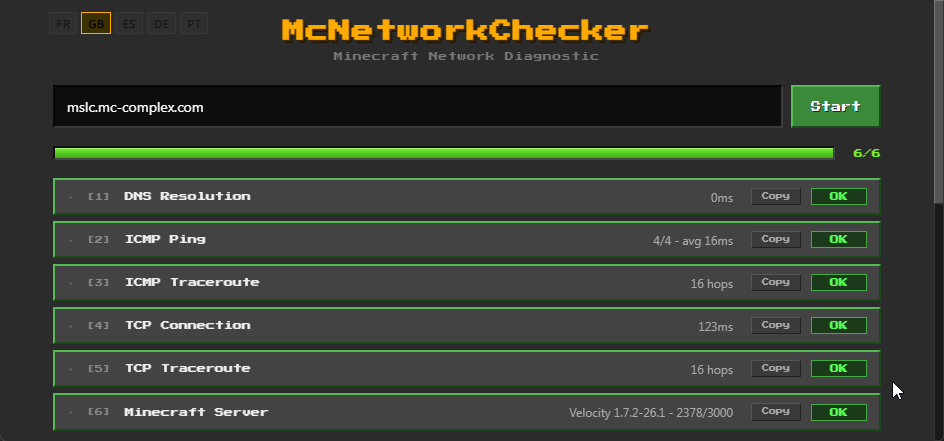
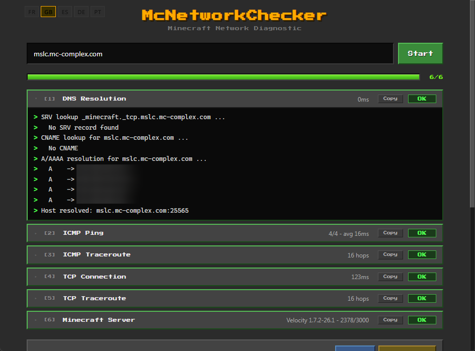
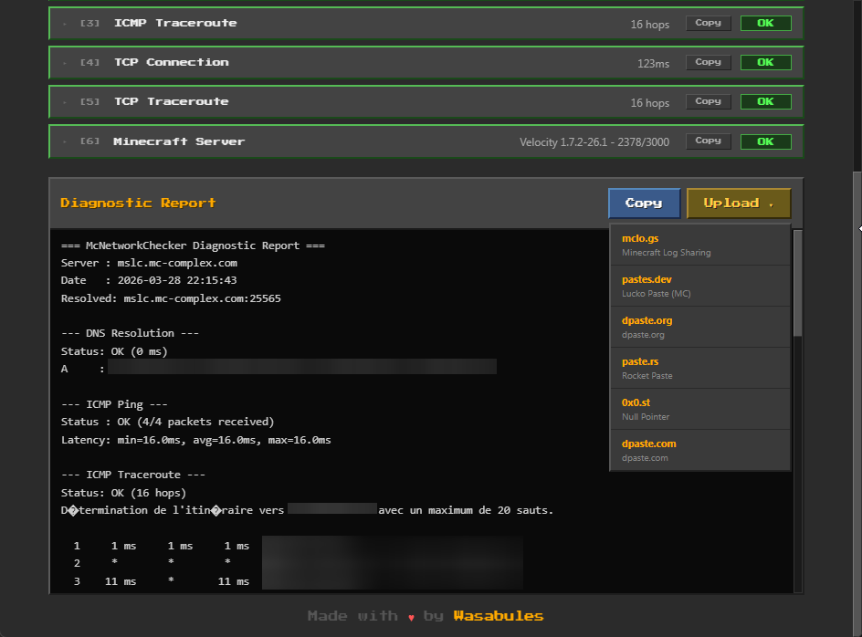

# McNetworkChecker



A cross-platform desktop application for diagnosing Minecraft server connectivity issues. Runs a full diagnostic pipeline in one click and generates a report you can share with your hosting provider.

Built with [Wails](https://wails.io/) (Go backend + Svelte frontend), Minecraft-themed UI.


## Features

### 6-Step Diagnostic Pipeline

| Step | What it does | Implementation |
|---|---|---|
| **DNS Resolution** | SRV `_minecraft._tcp`, CNAME, A/AAAA records | Pure Go `net` package |
| **ICMP Ping** | 4 packets, min/avg/max latency | Windows: `IcmpSendEcho` API (no admin) / Unix: `x/net/icmp` UDP |
| **ICMP Traceroute** | Network path to the server | System `tracert` / `traceroute` |
| **TCP Connection** | Port reachability + handshake latency | Pure Go `net.Dialer` |
| **TCP Traceroute** | Hop-by-hop port reachability | Hybrid: ICMP probe (router IPs) + TCP probe (port status) per TTL |
| **Minecraft SLP** | Server List Ping: version, MOTD, players, favicon | Full protocol implementation (handshake, status, ping/pong) |

### Additional Features

- **Rich MOTD rendering** with Minecraft color codes, bold/italic/obfuscated text
- **Real-time log streaming** with per-step live console output
- **Skip / Stop** controls to skip individual steps or abort the whole diagnostic
- **Collapsible step cards** to keep the UI compact
- **Diagnostic report** with one-click copy or upload to paste services
- **Paste services** integration: mclo.gs, pastes.dev, dpaste.org, paste.rs, 0x0.st, dpaste.com
- **i18n** with OS language auto-detection and manual picker (FR, EN, ES, DE, PT)
- **Address validation** with real-time feedback
- **Auto-skip** DNS step when a direct IP address is entered

### Cross-Platform

| Feature | Windows | macOS | Linux |
|---|---|---|---|
| ICMP Ping | `IcmpSendEcho` (no admin) | `x/net/icmp` UDP | `x/net/icmp` UDP |
| ICMP Traceroute | `tracert` (built-in) | `traceroute` (built-in) | `traceroute` (package) |
| TCP Traceroute | `setsockopt IP_TTL` + `IcmpSendEcho` for router IPs | `setsockopt IP_TTL` | `setsockopt IP_TTL` |
| Minecraft SLP | Pure Go | Pure Go | Pure Go |

No admin/root privileges required for any step.

## Build

### Prerequisites

- [Go 1.23+](https://go.dev/dl/)
- [Node.js 18+](https://nodejs.org/)
- [Wails CLI](https://wails.io/docs/gettingstarted/installation):
  ```bash
  go install github.com/wailsapp/wails/v2/cmd/wails@latest
  ```

### Development

```bash
wails dev
```

Opens the app with hot-reload for the frontend. Go methods are re-bound automatically.

### Production Build

```bash
wails build
```

Output binary in `build/bin/`.

### Verify Without Wails

```bash
# Go backend
go build ./...

# Frontend
cd frontend && npm install && npm run build
```

## Project Structure

```
McNetworkChecker/
├── main.go                          # Wails entry point
├── app.go                           # App struct, public API (Run/Stop/Skip/Locale/Paste)
├── diagnostic.go                    # Step orchestration with skip/stop support
├── paste.go                         # Paste service integrations (6 services)
│
├── checker/                         # Network diagnostic logic (no Wails dependency)
│   ├── types.go                     # FullDiagnostic aggregate type
│   ├── i18n.go                      # Backend i18n engine + all translations
│   ├── i18n_detect_{windows,unix}.go
│   ├── dns.go                       # DNS: SRV, CNAME, A/AAAA
│   ├── ping.go                      # Ping entry point
│   ├── ping_{windows,unix}.go       # Platform-specific ICMP
│   ├── tcp.go                       # TCP connectivity check
│   ├── traceroute.go                # ICMP traceroute (system command)
│   ├── traceroute_tcp.go            # TCP traceroute (pure Go, hybrid ICMP+TCP)
│   ├── traceroute_tcp_hop_{windows,unix}.go
│   ├── sockopt_{windows,unix}.go    # setsockopt IP_TTL
│   ├── minecraft.go                 # Minecraft SLP query
│   ├── minecraft_proto.go           # VarInt, packet builders/readers
│   ├── motd.go                      # MOTD parsing (chat components, colors)
│   ├── stream.go                    # Command streaming with context cancellation
│   └── report.go                    # Text report generator
│
├── frontend/
│   ├── src/
│   │   ├── App.svelte               # Main coordinator (state, events, layout)
│   │   ├── style.css                # Global Minecraft theme CSS
│   │   └── lib/
│   │       ├── i18n.js              # Frontend i18n (Svelte store, 5 languages)
│   │       ├── LangPicker.svelte    # Flag-based language selector
│   │       ├── InputBar.svelte      # Address input + validation
│   │       ├── ProgressBar.svelte   # XP-style progress bar
│   │       ├── StepCard.svelte      # Collapsible step card
│   │       ├── Console.svelte       # Auto-scroll log console
│   │       ├── MotdRender.svelte    # Rich MOTD rendering
│   │       ├── MinecraftInfo.svelte # Server info (favicon, MOTD, players)
│   │       └── Report.svelte        # Report display + copy + paste upload
│   └── wailsjs/                     # Auto-generated Wails bindings
│
└── wails.json                       # Wails configuration
```

## License

MIT License - Copyright (c) 2025

See [LICENSE](LICENSE) for the full text.

## Additionals screenshot




## Disclaimer

This tool is not affiliated with Mojang Studios or Microsoft. Minecraft is a trademark of Mojang Studios. McNetworkChecker is an independent diagnostic tool that uses the publicly documented [Server List Ping](https://wiki.vg/Server_List_Ping) protocol. No game files are included or modified.
